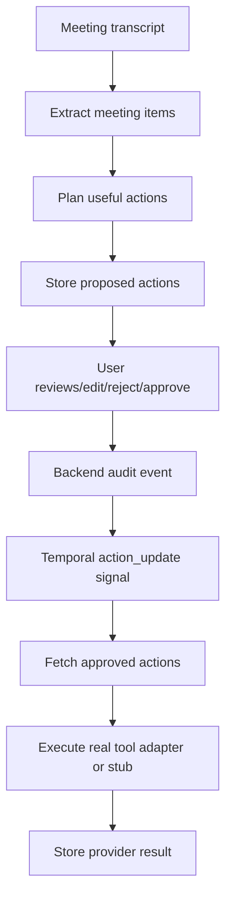

# Agentic Meeting And Event Assistant

The meeting assistant should behave like a careful operations partner: it reads
the meeting, extracts the useful facts, suggests next steps, and waits for
approval before touching calendars, reminders, tasks, messages, or documents.

## What The Agent Should Manage

- Follow-up meetings and calendar events
- Deadline reminders and notifications
- Assigned tasks and owners
- Meeting notes and durable summaries
- Tickets, project references, dependencies, blockers, and risks
- Follow-up emails or team messages

## Agent Decision Rules

- Suggest an action only when an external tool would clearly help.
- Do not create one tool action for every extracted item.
- Prefer `calendar_event` when the transcript proposes a future meeting,
  workshop, review, interview, launch, deadline event, or date-specific session.
- Prefer `reminder` when someone needs a nudge before a deadline.
- Prefer `task` when work is assigned to an owner.
- Prefer `document_note` or `notion_page` for durable meeting notes.
- Prefer `email`, `slack_message`, or `teams_message` only when there is a clear
  communication to send.
- Never execute a tool call directly from the LLM response.
- Always require user approval by default.

## Temporal Flow



## Payload Contracts

### Calendar Event

```json
{
  "title": "Follow-up planning review",
  "starts_at": "next Tuesday at 10:00",
  "ends_at": "next Tuesday at 10:30",
  "attendees": ["sara@example.com", "leo@example.com"],
  "description": "Review API documentation and open launch blockers.",
  "location": "Google Meet"
}
```

### Reminder

```json
{
  "title": "API documentation due",
  "remind_at": "Friday at 09:00",
  "owner": "Sara",
  "description": "Nudge Sara before the API documentation deadline."
}
```

### Task

```json
{
  "title": "Complete API documentation",
  "owner": "Sara",
  "due_date": "Friday",
  "priority": "high",
  "description": "Finalize the API documentation discussed in the meeting."
}
```

## Real Event Tool Next Step

The current repo records approved actions as stubs. To make event management
real, implement a provider adapter for `calendar_event`:

1. Add calendar provider credentials and a `CALENDAR_ENABLED` feature flag.
2. Add a `CalendarEventPayload` Pydantic model.
3. In `worker/activities/tools.py`, route `tool_type == "calendar_event"` to
   the calendar adapter when enabled.
4. Use `idempotency_key` as the provider-side dedupe key when possible.
5. Store `event_id`, `event_url`, provider name, and idempotency key in
   `execution_result`.
6. Keep user approval and audit logging unchanged.

For Gmail/email, follow [Real Tool Integrations](tool-integrations.md).
