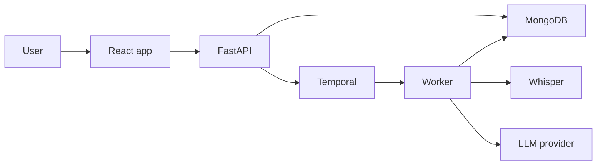
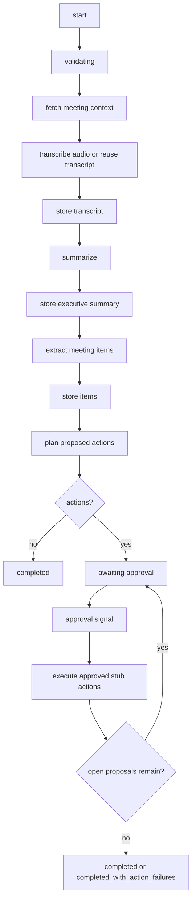

# Architecture

The app is a meeting-assistant platform with a React frontend, FastAPI backend,
MongoDB persistence, Whisper transcription service, and Temporal worker.

## Collections

- `meetings`: meeting metadata, upload pointer/hash, transcript, executive
  summary, status, workflow id, failure reason
- `meeting_items`: extracted discussion points, decisions, action items,
  owners, deadlines, open questions, risks, dependencies, dates, references
- `proposed_actions`: approval-gated tool proposals, editable payloads,
  idempotency keys, execution result/failure
- `audit_events`: consent confirmations, edits, approvals, rejections, retries,
  and tool execution records

## Temporal Workflow

`MeetingProcessingWorkflow` contains deterministic orchestration only.
Activities handle file/transcription/LLM/database/tool side effects.

The workflow uses retries with backoff. It can resume after worker failure
because Temporal records completed activities and Mongo stores intermediate
results for API reads.

## External Tools

The current implementation records approved tool actions as stubs. No Google
Calendar, reminder, task-management, Notion, Jira, email, Slack, Teams, or
document-system provider is called yet. Each action carries an idempotency key
so real adapters can prevent duplicate calendar events, tasks, tickets, or
messages when they are added later.

See [Real Tool Integrations](tool-integrations.md) for the adapter contract and
a Gmail implementation guide. See
[Agentic Meeting And Event Assistant](agentic-meeting-events.md) for the
meeting/event action rules and payload contracts.
